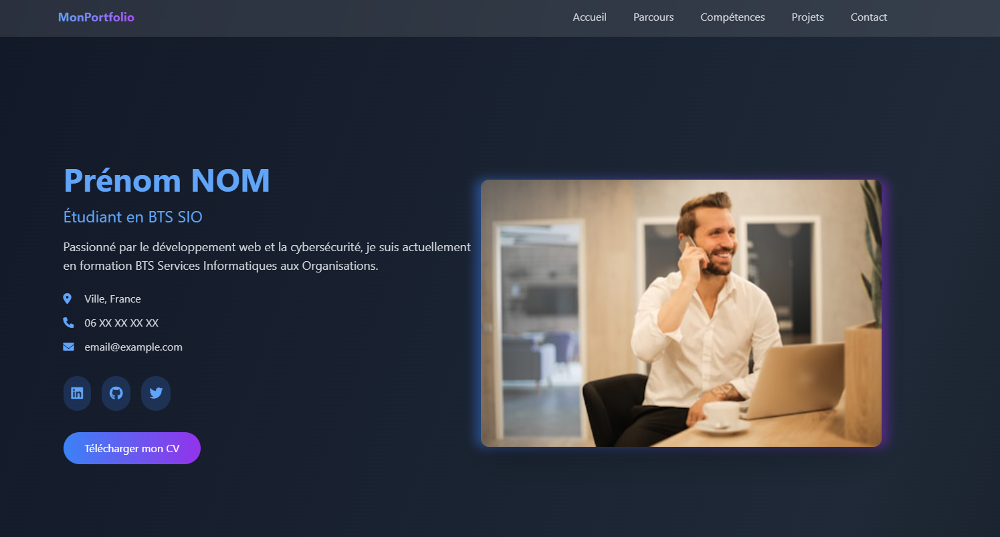
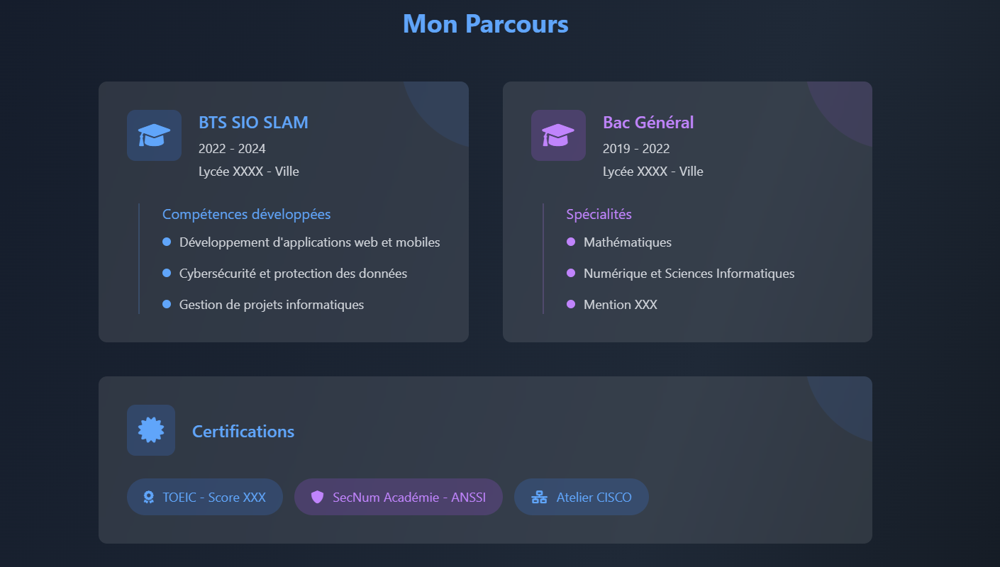
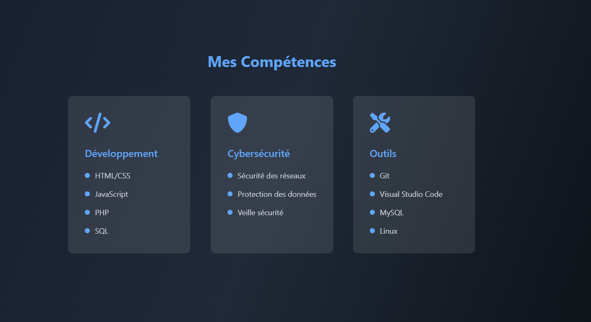
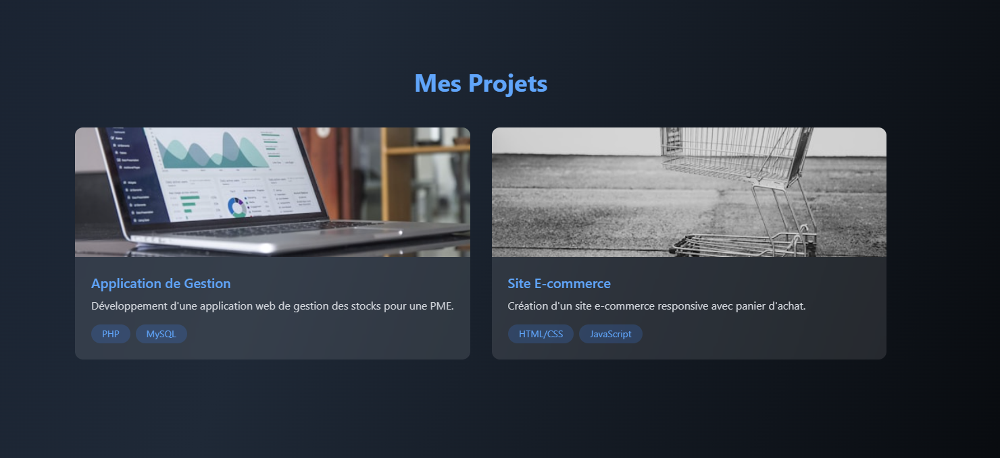
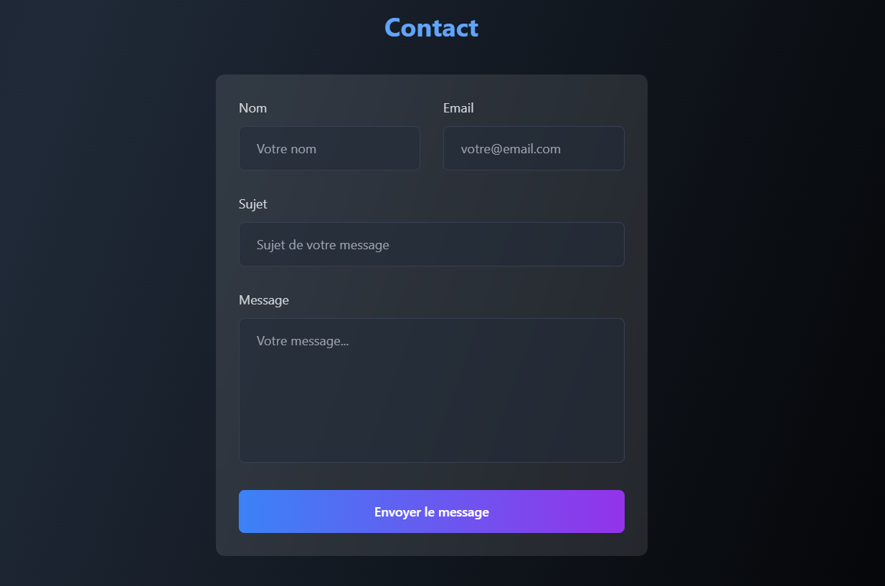
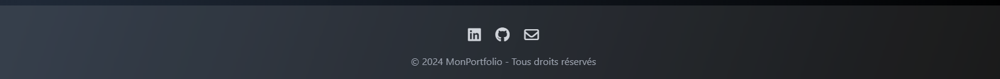
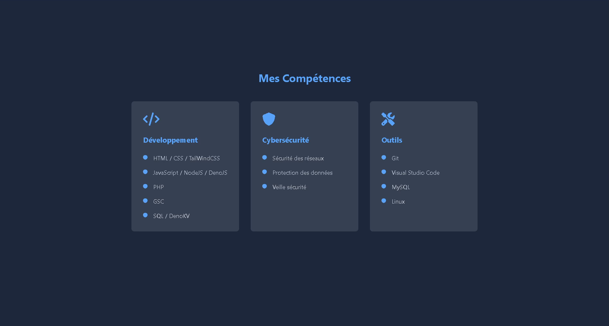

    <h1 id="readme-title">PortFolio - TailWindCSS - 10/02/2025</h1>
    <h4 id="readme-description">Reproduction d'une maquette de PortFolio donnée par le professeur Monsieur LAMY Franck au Lycée Louis Pergaud à Besançon lors de la formation BTS SIO SLAM 2024 / 2025 en Première année.</h4>
    
    
    
    
    
    
    
    
    
    
    
    
    
    
    
    
    
    
    
    
    

    
        <h3>Consignes :</h3>
        

            
            
            
            
            
            
        

    
        <h3>Résultat :</h3>
        

            <video id="readme-body-preview-navbar-accueil" src="./assets/images/preview/Navbar+Accueil.mp4" srcset="./assets/images/preview/Navbar+Accueil.mp4" controls autoplay loop muted></video>
            <video id="readme-body-preview-parcours" src="./assets/images/preview/Parcours.mp4" srcset="./assets/images/preview/Parcours.mp4" controls autoplay loop muted></video>
            
            <video id="readme-body-preview-projets" src="./assets/images/preview/Projets.mp4" srcset="./assets/images/preview/Projets.mp4" controls autoplay loop muted></video>
            <video id="readme-body-preview-contact" src="./assets/images/preview/Contact.mp4" srcset="./assets/images/preview/Contact.mp4" controls autoplay loop muted></video>
            
        

    
        

            <h3><strong>Testé uniquement sur Windows 11 24H2 (<code>26100.3037</code>) !</strong></h3>
        

    
        <h3>Prérequis</h3>
        
<strong>Installation</strong> de <a href="https://www.php.net/releases/8.4/fr.php" target="_blank">PHP (<code>8.4.0</code>)</a>

    
        <h3>Installation</h3>
        
<strong>Lancement</strong> du <strong>Serveur WEB</strong> avec la commande : <code>php -S localhost:8000 -t ./routes .\index.php</code>

CL 2025 <a id="readme-footer-repo" href="https://github.com/AmandAlexandrePro/portfolio-tailwindcss">PortFolio - TailWindCSS - 10/02/2025</a> &lt;/&gt; et 🖼 avec ❤ par <a id="readme-footer-author" href="https://github.com/AmandAlexandrePro">AMAND Alexandre</a> et les <a id="readme-footer-contributors" href="https://github.com/AmandAlexandrePro/portfolio-tailwindcss/graphs/contributors">contributeurs</a>.

